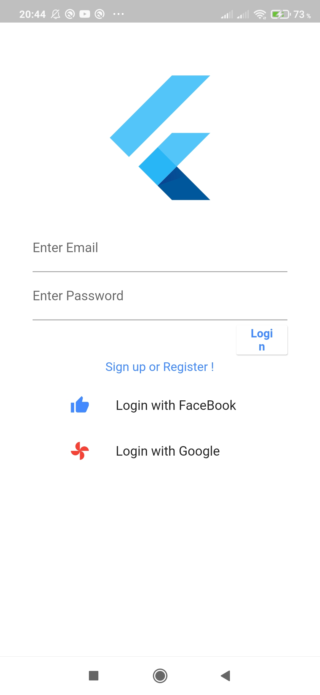
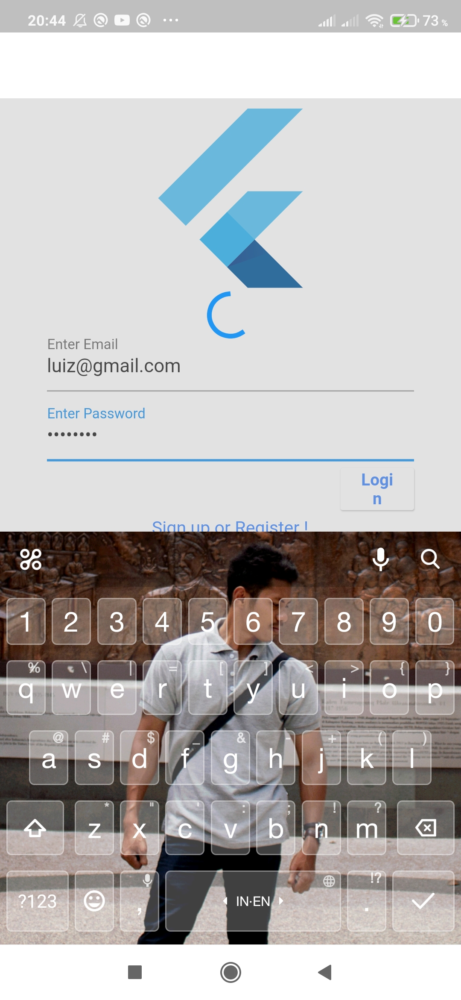
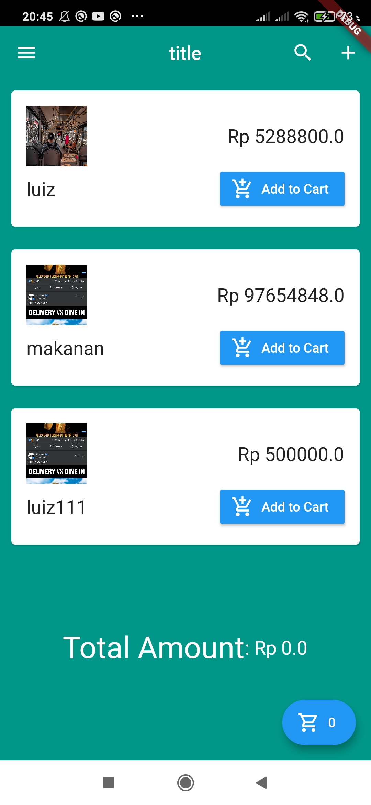
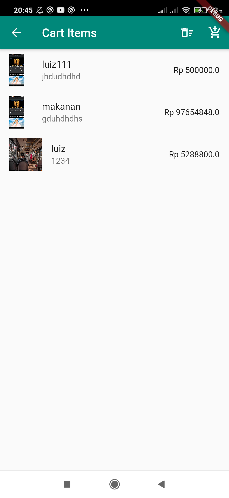
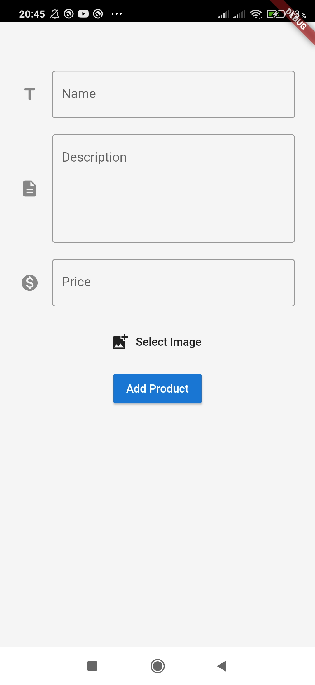

Persiapan
-------------------------------------------------------------------------------------------------------------------------------
INSTALL FLUTTER
-------------------------------------------------------------------------------------------------------------------------------
Persiapan : Install Visual Studio Code (Pilih Sesuai OS)

- File Master Flutter Bisa Download File Flutter Disini (https://flutter.dev/docs/get-started/install/windows)
- Untuk Mac Atau Linux bisa cek disini (https://flutter.dev/docs/get-started/install )
- Instalasi Flutter Cek Vidio (https://www.youtube.com/watch?v=kx0jbUQIS10 )
- Versi Lengkap : Integrasi dengan VS Code Bisa Cek disini (https://www.youtube.com/watch?v=5izFFbdHnWY ) tapi Sebelum nya Aktifkan Emulator nya dulu ya, atau jika Emulator pada Android Studio Teralu Besar/Berat bisa Coba Emulator lain Seperti Geny Montion, atau Build Langsung di Real Device Smartphone android nya.

FIREBASE
------------------------------------------------------------------------------------------------------------------------------

- Masuk di https://console.firebase.google.com 
- Buat Project Dengan Cara klik Add Project
- Masukan Nama project klik Create Project
- Pilih Icon Android (Untuk Integrasi dengan Project Flutter Android)
  
- Masukan android package name : contoh (com.latihan3.project) terserah anda.
- Masukan app nick name : contoh (latihan3) terserah anda.
- Masukan Debug signing certificate SHA-1 : (Cara Mendapat SHA1-1 : Masuk ke CMD (Windows) ketikan perintah :

keytool -list -v -keystore "C:\Users\yourname\ .android\debug.keystore" -alias androiddebugkey -storepass android -keypass android

Catatan : Ganti Tulisan yourname diatas dengan Path Android anda di PC/Laptop

- Copy SHA1 nya paste pada Form Register APP di Console Firebase Setelah itu Klik Register
  
- Download file (google-service.json)
  
- Masuk Kembali ke Console Firebase Klik Menu Sidebar Authentication dan klik Tab Sign-in method.
  
- Pilih field project support email Pilih/ganti dengan Email anda.
- Pilih google dan Aktifkan Radio Button di kanan atas Menajadi Enable.
  

INSTALASI PROJECT
---------------------------------------------------------------------------------------------------------------------------

- Clone Project ini.
- Setting File Build.grandle di folder Project ( Android/app/build.grandle) ganti DefaultConfig : applicationId dengan android package
name: contoh(com.latihan3.project)  yang tadi anda sudah register.
  
  

- Di paling bawah file build.grandle setelah depedencies tambahkan plugin (apply plugin : ‘com.google.gms.google.services’)
  
- Setelah itu Config File build.grandle yang kedua terletak di (android/build.grandle) jadi kita akan mengonfig 2 File Grandle tetapi yang satu di path (android/app/build.grandle) yang tadi sudah kira config diatas dan yang satu lagi di path(android/build.grandle) oke buka file build.grandle di path (android/build.grandle) tambahkan classpath didalam dependencies (classpath ‘com.google.gms:google-services:3.2.1’).

  
  
  
- Setelah itu Copy File google-services.json yang tadi sudah kita download ke Project kita paste di Path (android/app/).
  
  
- Pastikan Emulator kita berjalan dengan Baik.
- RUN Project dengan Menekan F5.

SELAMAT MENCOBA

# APLIKASI SHOPING DENGAN FIREBASE

*Cara Install
- install seperti biasa
- akan langsung ke menu login bila belum akun bisa registrasi atau dengan cara artenatif yaitu dengan google maupun facebook
- setelah selesai akan tampil menu shoping
- kalau ingin tambah produk silahkan klik icon + di pojok kanan atas tambah kan produk anda seperti nama,deskripsi,harga dan juga gambar setelah itu klik add product
- setelah menambah produk akan muncul di bagian branda bila ingin beli langsung klik add to cart setelah akan ada total dari barang yang beli.
- untuk mengecek apa saja yang dibeli beisa langsung ke tombol keranjang di bagian bawah pojok kanan setelah diklik akan muncul item yang dibeli dan bila tidak ingin membeli silahkan klik hapus pada icon hapus pada pojok kanan atas.
-sekian dan terima kasih

## [VIDEO CARA PENGOPERASIKAN APLIKASI SHOP FIREBASE](https://youtu.be/SGoaK9ZJEcc) <== klik disini

## Tampilan Aplikasi

